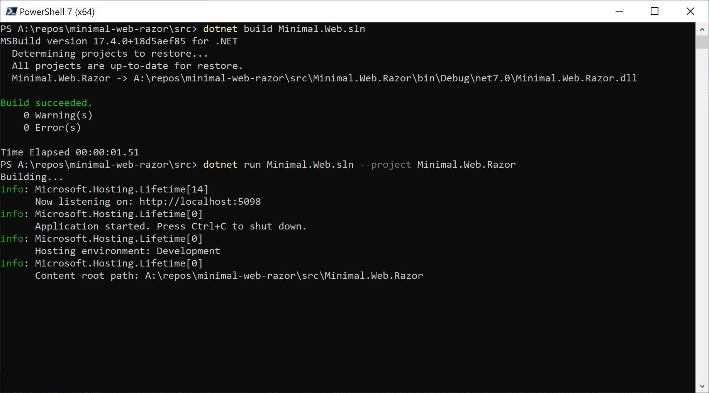
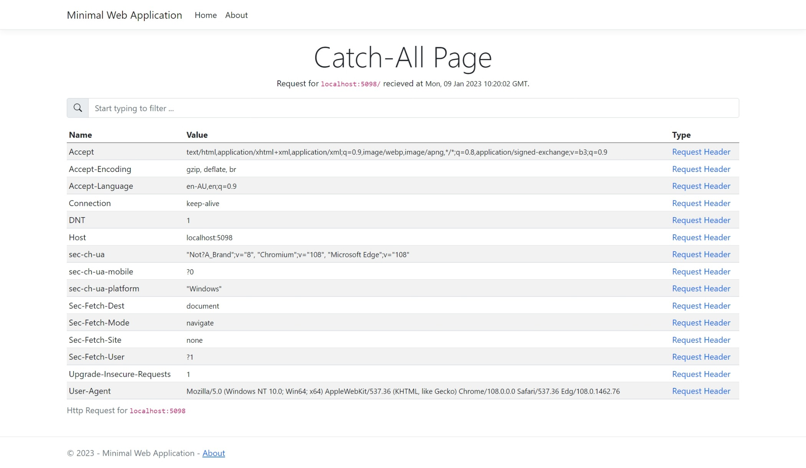

# A Minimal Web Application (Razor Pages)

## Overview
This is a Minimal ASP.NET (7.0.0.0) Web Application that:

- Exposes health checks via the /healthz (via Microsoft.Extensions.Diagnostics.HealthChecks)
- Redirects all other requests to a catch-all Razor Page that outputs the http connection, header and query properties.
- All headers that start with X-AZURE or X-FORWARDED are logged to App Insights.

You can use this application when testing different hosting configurations.

### Demo
Try the following urls:
- https://minimal-web-razor-demo-wapp.azurewebsites.net
- https://minimal-web-razor-demo-wapp.azurewebsites.net/healthz
- https://minimal-web-razor-demo-wapp.azurewebsites.net/path/to/non/existant/folder/handled/by/catch-all
- https://minimal-web-razor-demo-wapp.azurewebsites.net/test-query-string?key1=value1&key2=value2

## How to run this sample
### Clone the repo
> git clone https://github.com/rohit-lakhanpal/minimal-web-razor.git

### Build the solution
> cd minimal-web-razor/src

> dotnet build Minimal.Web.sln

### Run the project
    > dotnet run Minimal.Web.sln --project Minimal.Web.Razor

## Expected output
After navigating to the url (based on `dotnet run Minimal.Web.sln --project Minimal.Web.Razor`) this is what you can expect.

## About the code
This minimal application is based on the [minimal-web](https://github.com/rohit-lakhanpal/minimal-web) project and has been adapted for Razor Pages.

I have additionally added the following packages:
- Microsoft.Extensions.Diagnostics.HealthChecks
- Microsoft.ApplicationInsights.AspNetCore